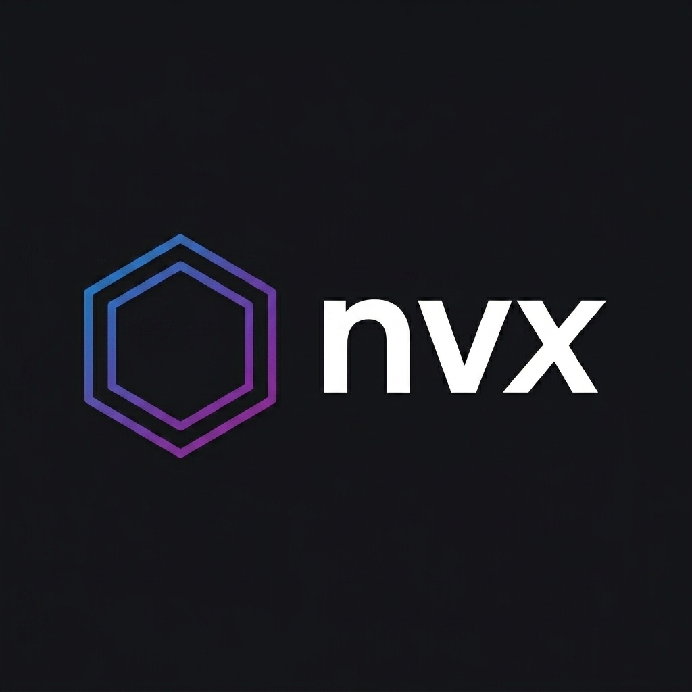

# nvx — Secure Runtime Version and Package Manager




[](#) [](#) [](#) [](LICENSE)


`nvx` is a zero-dependency, ultra-fast, and security-conscious version and package manager. Originally built to address the lack of robust, fast native runtime version managers on Windows, it naturally supports macOS and Linux as a cross-platform tool. 

It wraps package managers (`npm`/`yarn`/`pnpm`) and executors (`npx`/`bunx`) to enforce cascading policy files, check for typosquatting, scan for vulnerabilities, and run untrusted code inside native process-level sandboxes.


---

## Why nvx?

With modern LLMs, it's now practical to just build the exact tools you want. While setting up a clean development machine on Windows and facing the usual version manager headaches, I got thinking: *Why not build a modern, fast, secure runtime manager from scratch and solve this problem for good?*

Along the way, I wanted to tackle a few other common frustrations:
- **Supply Chain Safety**: Typosquatting and malicious postinstall scripts are a growing issue. `nvx` intercepts installs on the fly to flag or block suspected threats based on policies and registry checks.
- **Agentic & AI Safety**: If you use AI coding agents (like Gemini, Claude, or Copilot) to build projects, they execute terminal commands in your local workspace. By automatically wrapping typical package manager commands (`npm`, `yarn`, `pnpm`, `npx`), `nvx` ensures that any package installed or run by an AI agent is audited and secured out of the box. You don't have to worry about agents running raw commands in your shell; they are wrapped automatically, significantly reducing the risk of an agent pulling down a compromised package or executing rogue code.
- **Process Isolation**: I wanted a sandbox to run untrusted stuff (like `npx` packages) with a clean slate, scrubbing env secrets and locking down filesystem writes.
- **Sub-millisecond Performance**: The tool has to be fast enough that there's no noticeable overhead compared to running raw commands.
- **Clean UX**: I am constantly polishing the interface and shell integration hooks, with interactive documentation hosted on GitHub Pages and Cloudflare.


---


## Features

- **Multi-Runtime Core**: Built to manage multiple runtimes (currently supports Node.js; extendable via `RuntimeProvider` to Bun, Deno, or other non-JavaScript/non-TS runtimes like Python, Go, and Rust).
- **Cascading Security Policies**: Resolves global and local directory-level policy blocks from `.nvx-policy.json`.
- **Registry-Backed Typosquatting Audits**: Cross-checks package names against a synced list of popular packages and queries the npm registry download API dynamically to verify download counts and distinguish typosquats from legitimate packages.

- **OSV Vulnerability Batch Scanning**: Audits dependency packages against the live Open Source Vulnerabilities database during install.
- **Supply-Chain Verification**: Flags package updates released in the last 24 hours (mitigating compromise propagation windows).
- **Native Sandbox Engine**: 
  - Purges credential/secret environment keys before execution.
  - Redirects home profile path (`HOME` / `USERPROFILE`) to temporary guest environments.
  - Uses Windows Low Integrity Level tokens and Linux Kernel Namespaces (`CLONE_NEWNS`, `CLONE_NEWPID`, `CLONE_NEWUSER`) for secure sandboxing.
- **Shell Integrations**: Automatic shell configuration for bash, zsh, and PowerShell.

---

## Installation

### Windows (PowerShell)

Run the installer via PowerShell:

```powershell
irm https://raw.githubusercontent.com/nvx-project/nvx/main/install.ps1 | iex
```

*Note: In future releases, I plan to make `nvx` accessible directly via **WinGet**, the **Windows Store**, and other popular repository managers for even easier setup.*

### macOS / Linux (Shell)

Run the installer via bash:

```bash
curl -fsSL https://raw.githubusercontent.com/nvx-project/nvx/main/install.sh | sh
```

---

## CLI Usage

```text
nvx <command> [arguments]

Commands:
  install <version>      Download and install a Node.js version (e.g. 20, lts, latest)
  uninstall <version>    Remove an installed Node.js version
  use <version>          Switch Node.js version in the current terminal session (downloads automatically if missing)
  default <version>      Set the global default Node.js version (creates a link)
  list, ls               List all installed Node.js versions
  list-remote, ls-remote List available Node.js versions from nodejs.org
  env [--shell=<type>]   Print shell integration script (powershell, bash, zsh)
  auto [--shell=<type>]  Auto-switch version based on .nvmrc / .node-version / package.json
  verify-install <pkgs>  Verify package safety before installing (called by wrappers)
  sandbox, s <cmd> [arg] Run a command inside the nvx sandbox (env isolation + OS primitives)
  cleanup                Remove stale sandbox sessions from previous runs
  version, -v            Print version info
```

### Auto-Swapping

`nvx` automatically detects configuration files (`.nvmrc`, `.node-version`, and `package.json` engines) when you navigate to a directory, prompting to install the required Node.js version if missing, and switching to it seamlessly.

---

## Policies (`policy.json` / `.nvx-policy.json`)

Corporate policies can be defined globally in `~/.nvx/policy.json` and customized per-project via `.nvx-policy.json`:

```json
{
  "blocked_packages": ["rimraf", "malicious-pkg-*"],
  "enforce_ignore_scripts": false,
  "typosquatting": {
    "enabled": true,
    "max_distance": 2,
    "trusted_packages": ["my-internal-helper"]
  },
  "isolation": {
    "enabled": true,
    "provider": "native",
    "runtime": {
      "command": "node",
      "version": "20"
    }
  }
}
```

### Policy Reference
* **`enforce_ignore_scripts`**: When `true`, this forces npm/yarn/pnpm to install packages with `--ignore-scripts`. This blocks execution of hook scripts (`preinstall`/`postinstall`/`install`), which are heavily used in supply chain attacks to download and execute arbitrary binaries on the host machine.
* **`isolation.provider`**: The sandbox engine to use.
  - `native`: Uses OS-native isolation primitives (Windows Low Integrity Level tokens and Linux Namespaces).
  - `docker`: Spawns executions inside a Docker container.
* **`isolation.runtime.command`**: Optional name of the command to restrict pinning to (e.g. `node`). If specified, only matches of this command will run on the pinned version.
* **`isolation.runtime.version`**: Pin a specific runtime version query (e.g. `20`, `lts`, `18.16.0`) to be used inside the sandbox instead of inheriting the host terminal session's active version.


---

## Sandboxed Executions

To execute commands isolated from your host's credentials and files, use the `sandbox` (or `s`) subcommand. This runs the guest process under actual process-level containerization (container isolation, not just simple fencing or env key scrubbing):

```bash
nvx s npx create-react-app my-app
```
Alternatively, you can use the direct `nvxs` command shorthand provided by the shell integration:


```bash
nvxs npx create-react-app my-app
```

When running in the sandbox:
* Environment secrets (e.g. `AWS_*`, `GITHUB_*`, `SSH_*`) are automatically scrubbed from the process.
* The home profile path (`HOME` or `USERPROFILE`) is virtualized to a clean temporary guest directory.
* OS-level privilege tokens are lowered to prevent writes to host paths.

---

## Design DX & Architecture FAQ

### How does auto-swapping work alongside concurrent terminal sessions?
Traditional managers change system-wide paths or symbolic links, which can disrupt active builds running in other windows. `nvx` avoids this by configuring the paths (`PATH`, `NPM_CONFIG_PREFIX`) strictly at the **shell session level**. When you change versions in one shell (or navigate to a directory triggering auto-swap), only that shell’s environment is updated. Other concurrent processes are completely unaffected.

### How do sandboxed containers handle local servers, ports, and networking?
Web development requires running local dev servers (e.g. listening on port `3000`) and calling external backend APIs or databases:
* **Native Sandbox (Windows LIL / Linux Namespaces)**: Guest processes are restricted from making malicious disk writes, but retain the ability to bind to TCP ports (`localhost`) and connect to local services running on the host out of the box.
* **Docker Sandbox**: The Docker container automatically exposes loopback TCP configurations so that the containerized process can reach a backend running locally on the host machine.

### What if a project needs multiple runtimes (e.g., Node frontend and Python/Go backend)?
* **Native Sandbox**: Since the sandbox scrubs environment variables and configures paths on top of your host's standard toolchains, other runtimes installed on your machine (like Python or Go) are fully visible and execute alongside Node.js.
* **Docker Sandbox**: The default Docker isolation uses a base Node.js image (e.g., `node:20`). If you require a multi-language stack (Node + Python), you can easily package a custom Dockerfile or spin them up via standard container tools (like `docker-compose`) to network them together.

### Does nvx handle TypeScript and bundler commands?
Yes! Since `nvx` hooks into the active runtime context, any globally or locally installed tools—including `tsc`, `ts-node`, `vite`, or `webpack`—execute within the selected Node.js environment automatically.

### How does automatic command wrapping protect me when using AI coding agents?
When AI coding agents (like Gemini, Claude, or Copilot) interact with your workspace, they typically run standard commands such as `npm install <package>` or `npx <command>`. Because `nvx` automatically wraps these typical binaries inside the shell session, those commands are transparently intercepted. The packages are verified via typosquatting and vulnerability registry checks, and executors are run within the native sandbox environment. This happens automatically without any special configuration or wrapper commands required from the agent, meaning you don't have to worry about an autonomous agent accidentally downloading or executing a malicious supply-chain package.

---

## License

This project is licensed under the MIT License. See [LICENSE](LICENSE) for details.

