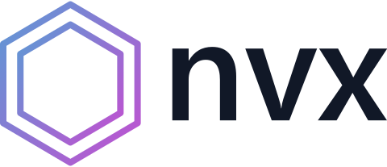

<div align="center">

<picture>
  <source media="(prefers-color-scheme: dark)" srcset="site/public/assets/wordmark.png">
  
</picture>

*A Node.js and Bun version manager that runs what your agent installs inside an OS sandbox.*

[](https://github.com/fstubner/nvx/actions/workflows/ci.yml)
[](LICENSE)

**[Documentation](https://nvx.run/docs/)** · **[Install](https://nvx.run/docs/install/)** · **[Changelog](https://nvx.run/changelog/)**

</div>

When a coding agent runs `npm install`, it executes code from strangers with your
credentials within reach. nvx puts that command inside an OS sandbox with a
throwaway `HOME`, writes confined to the project, and an allowlist for anything it
tries to reach over the network. On Windows and Linux it cannot read `~/.ssh` or
`~/.npmrc` either. On macOS reads are not contained, and the
[known limitations](https://nvx.run/docs/limitations/) say so plainly.

**You do not change how you run anything.** nvx installs shims on `PATH`, so
`npm install` is still `npm install`, contained when it runs code you did not
write. Other sandboxes need `theirtool run -- npm install`, and an agent will not
remember to type it.

It is also a Node.js and Bun version manager, because it has to be. The shims that
intercept the toolchain are the same ones that switch runtimes on `cd`. If you use
nvm, fnm or volta today, nvx replaces them.

## Why this exists

With modern LLMs, it's now practical to just build the exact tools you want. While
setting up a clean development machine on Windows and facing the usual version
manager headaches, I got thinking: *Why not build a modern, fast, secure runtime
manager from scratch and solve this problem for good?*

Coding agents run terminal commands in your workspace, and installs are where they
pick up code nobody has read. No tool can promise a package is safe, so the goal is
to limit what one can reach if the checks miss it.

## Install

```powershell
# Windows
irm https://nvx.run/install.ps1 | iex
```

```bash
# macOS / Linux
curl -fsSL https://nvx.run/install.sh | sh
```

Prebuilt binaries, building from source and what the installer changes are in the
**[install guide](https://nvx.run/docs/install/)**.

## Usage

```bash
nvx install lts          # install a Node.js version
nvx install bun@1.2      # or a Bun one
nvx use 22               # switch this shell
npm install              # contained, through the shim
nvx --strict npm test    # contain your own code too
nvx doctor               # check interception and containment
```

Full reference: **[Commands](https://nvx.run/docs/commands/)** ·
**[Policy](https://nvx.run/docs/policy/)**

## Documentation

| Page | Covers |
| --- | --- |
| [Overview](https://nvx.run/docs/) | What nvx does, and what it deliberately does not |
| [Installation](https://nvx.run/docs/install/) | Every install route, per platform |
| [Containment](https://nvx.run/docs/containment/) | What a contained command can reach, and what backs each claim |
| [Policy](https://nvx.run/docs/policy/) | Global and project policy files, and every setting |
| [Known limitations](https://nvx.run/docs/limitations/) | What containment does not cover |
| [Commands](https://nvx.run/docs/commands/) | Commands, flags and environment variables |
| [FAQ](https://nvx.run/docs/faq/) | Switching, networking, mixed runtimes, agents |

The threat model is in [SECURITY.md](SECURITY.md), and the per-platform evidence
behind every containment claim is in
[docs/enforcement-matrix.md](docs/enforcement-matrix.md).

## Contributing

Issues and pull requests are welcome. Building from source and running the
sandbox probes are in [CONTRIBUTING.md](CONTRIBUTING.md).

## License

MIT
