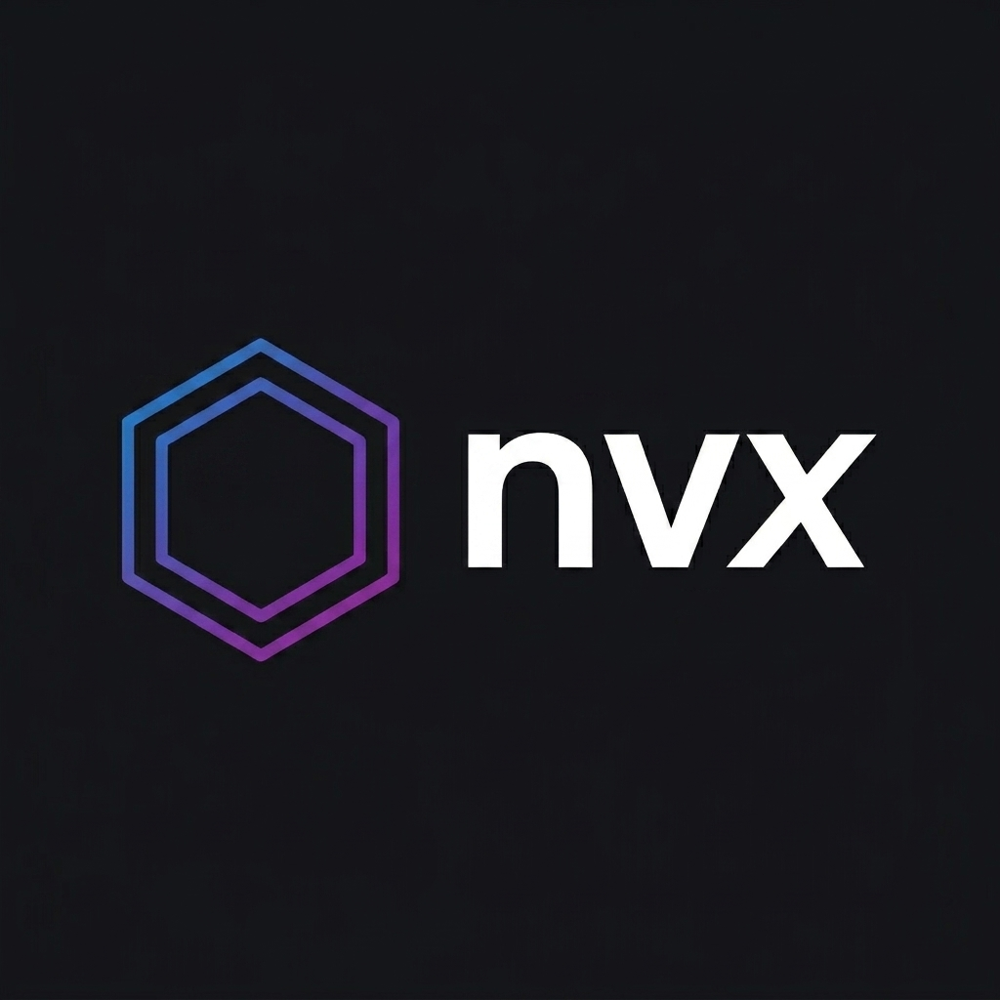

# nvx — Secure Runtime Version and Package Manager




[](#) [](#) [](#) [](LICENSE)


`nvx` is a fast, cross-platform runtime version manager that **audits and sandboxes everything `npm`/`bun` installs — including whatever your AI coding agents run**. It manages Node.js and Bun like nvm/fnm, then adds an ambient security layer on top: every wrapped `npm`/`yarn`/`pnpm`/`npx`/`bun`/`bunx` command is checked for typosquatting and known vulnerabilities and executed inside a native OS sandbox.

Zero dependencies, one static binary, Windows/macOS/Linux. Originally built to fix the lack of a fast native runtime manager on Windows; the security layer is what makes it worth switching to.


---

## Why nvx?

With modern LLMs, it's now practical to just build the exact tools you want. While setting up a clean development machine on Windows and facing the usual version manager headaches, I got thinking: *Why not build a modern, fast, secure runtime manager from scratch and solve this problem for good?*

Along the way, I wanted to tackle a few other common frustrations:
- **Supply Chain Safety**: Typosquatting and malicious postinstall scripts are a growing issue. `nvx` intercepts installs on the fly to flag or block suspected threats based on policies and registry checks.
- **Agentic & AI Safety**: If you use AI coding agents (like Gemini, Claude, or Copilot) to build projects, they execute terminal commands in your local workspace. By automatically wrapping typical package manager commands (`npm`, `yarn`, `pnpm`, `npx`, `bun`, `bunx`), `nvx` ensures that any package an AI agent installs is audited and anything it runs is contained — with no agent configuration required. No tool can promise a package is safe, but even if a compromised package slips past the checks, it runs inside the sandbox: secrets scrubbed, filesystem writes confined to the project, and network limited to an allowlist. So a bad package can't quietly read your `.env` or phone home.
- **Process Isolation**: I wanted a sandbox to run untrusted stuff (like `npx` packages) with a clean slate, scrubbing env secrets and locking down filesystem writes.
- **Thin wrapper**: A single static Go binary with no runtime dependencies. Each wrapped command runs through one extra short-lived process; resolved binary paths are cached (keyed by `PATH`) so the shim doesn't rescan `PATH` on every call. Measured dispatch overhead: **~3 ms on Linux, ~4 ms on macOS, ~38 ms on Windows** (process creation is costlier there) — imperceptible next to the commands you actually wait on like `npm install`. Reproduce it with [`scripts/bench.py`](scripts/bench.py).
- **Clean UX**: Polished CLI output and automatic shell integration hooks for PowerShell, bash, and zsh.


---


## Features

- **Multi-Runtime Core**: Manages **Node.js, Bun, Deno, Go, and Python** today through a `RuntimeProvider` interface designed to extend to further runtimes (Rust) — see [docs/runtime-providers.md](docs/runtime-providers.md). Select a runtime with `runtime@version` (e.g. `nvx install bun@1.2`, `nvx install deno@2.1`, `nvx install go@1.23`, `nvx install python@3.12`); a bare version stays Node.js for nvm compatibility.
- **Cascading Security Policies**: Resolves global and local directory-level policy blocks from `.nvx-policy.json`.
- **Registry-Backed Typosquatting Audits**: Cross-checks package names against a synced list of popular packages and queries the npm registry download API dynamically to verify download counts and distinguish typosquats from legitimate packages.

- **OSV Vulnerability Batch Scanning**: Audits direct install packages, executor packages, and packages resolved from `package-lock.json` against the live Open Source Vulnerabilities database during install. If no lockfile is present, `package.json` package names are checked as a best-effort fallback.
- **Supply-Chain Verification**: Flags package versions published within a configurable window (default 24 hours); trusted packages are exempt.
- **Native Sandbox Engine**: 
  - Purges credential/secret environment keys before execution.
  - Redirects home profile path (`HOME` / `USERPROFILE`) to temporary guest environments.
  - Uses Windows AppContainer, Linux Landlock + kernel namespaces, and macOS Seatbelt (`sandbox-exec`) for secure sandboxing.
- **Shell Integrations**: Automatic shell configuration for bash, zsh, and PowerShell.

---

## Installation

### Windows (PowerShell)

Run the installer via PowerShell:

```powershell
irm https://raw.githubusercontent.com/fstubner/nvx/main/install.ps1 | iex
```

*Note: In future releases, I plan to make `nvx` accessible directly via **WinGet**, the **Windows Store**, and other popular repository managers for even easier setup.*

### macOS / Linux (Shell)

Run the installer via bash:

```bash
curl -fsSL https://raw.githubusercontent.com/fstubner/nvx/main/install.sh | sh
```

---

## CLI Usage

```text
nvx <command> [arguments]

Commands:
  install <[rt@]version>   Install a runtime version. Bare version = Node.js
                           (e.g. 20, lts, latest); prefix a runtime with @
                           (e.g. bun@1.2, bun).
  uninstall <[rt@]version> Remove an installed runtime version
  use <[rt@]version>       Switch the current terminal session (installs if missing)
  default <[rt@]version>   Set the global default for a runtime (creates a link)
  list, ls                 List installed runtimes and versions
  list-remote, ls-remote   List available Node.js versions from nodejs.org
  env [--shell=<type>]     Print shell integration script (powershell, bash, zsh)
  auto [--shell=<type>]    Auto-switch based on .nvmrc / .node-version /
                           .bun-version / package.json engines
  verify-install <pkgs>    Verify package safety before installing (called by wrappers)
  init-shims               Generate PATH shims in ~/.nvx/bin
  policy init              Create default policy files (--global, --project, --force)
  cleanup                  Remove stale sandbox sessions from previous runs
  version, -v              Print version info

Shim flags (node, npm, npx, yarn, pnpm, bun, bunx, deno, go, python via PATH):
  --no-sandbox             Run without sandbox for this invocation
  --filesystem-provider=<name>  Override isolation.filesystem.provider
                           (native | docker; experimental: wsl, wslc, systemd-nspawn)
```

### Zero-config sandbox

After `nvx env` / `init-shims`, **`node`, `npm`, `npx`, `yarn`, `pnpm`, `bun`, `bunx`, `deno`, `go`, and `python` are sandboxed by default** when `isolation.enabled` is true. No separate sandbox subcommand — just run commands normally:

```bash
npm install
npm run dev
node server.js
```

Use `--no-sandbox` on a shim invocation to bypass isolation for one command.

After `npm install`, run `nvx init-shims` (or any npm/yarn/pnpm shim) to refresh **project bin shims** in `.nvx/project-bin/`. These wrap `node_modules/.bin` tools so local CLIs (e.g. `vite`, `eslint`) are sandboxed too.

### Non-Interactive Use (CI)

Security prompts (vulnerability warnings, install script confirmations, typosquatting alerts) **fail closed** when no interactive terminal is available: the operation is denied rather than silently approved. In CI pipelines, set `NVX_YES=true` to approve prompts explicitly. For direct `nvx` commands, leading `-y` / `--yes` is also supported; package-manager flags after a shim command are forwarded to the package manager.

### Auto-Swapping

`nvx` automatically detects configuration files (`.nvmrc`, `.node-version`, and `package.json` engines) when you navigate to a directory, prompting to install the required Node.js version if missing, and switching to it seamlessly.

---

## Policies (`policy.json` / `.nvx-policy.json`)

Corporate policies can be defined globally in `~/.nvx/policy.json` and customized per-project via `.nvx-policy.json`:

```json
{
  "blocked_packages": ["rimraf", "malicious-pkg-*"],
  "enforce_ignore_scripts": false,
  "typosquatting": {
    "enabled": true,
    "max_distance": 2,
    "trusted_packages": ["my-internal-helper"]
  },
  "release_age": {
    "enabled": true,
    "min_age_hours": 24
  },
  "runtime": {
    "default": "node",
    "versions": { "node": "20" }
  },
  "isolation": {
    "enabled": true,
    "filesystem": {
      "provider": "native",
      "mode": "strict"
    },
    "network": {
      "mode": "proxy",
      "default_allow": ["registry.npmjs.org:443", "api.osv.dev:443"],
      "allow_hosts": ["localhost:5432"],
      "prompt_unknown": true
    }
  },
  "prompts": {
    "interactive": "ask",
    "non_interactive": "deny",
    "network_unknown": "ask"
  },
  "environment": {
    "isolated_tools": false
  }
}
```

Policies cascade: the global policy applies everywhere, and local policy files merge over it as you get closer to the working directory (the nearest policy wins on conflicting settings; blocklists and trusted packages are unioned).

### Policy Reference
* **`enforce_ignore_scripts`**: When `true`, this forces npm/yarn/pnpm to install packages with `--ignore-scripts`. This blocks execution of hook scripts (`preinstall`/`postinstall`/`install`), which are heavily used in supply chain attacks to download and execute arbitrary binaries on the host machine.
* **`isolation.filesystem.provider`**: Where the process runs (filesystem + process boundary). See the [enforcement matrix](docs/enforcement-matrix.md) for exact guarantees.
  - `native` (default): AppContainer (Windows), Landlock + namespaces (Linux), Seatbelt (macOS). Zero-config, fail-closed.
  - `docker`: runs in a container (hardened; `offline`/`loopback` enforced via `--network none`). Requires Docker running.
  - `wsl`, `wslc`, `systemd-nspawn`: experimental; require `NVX_EXPERIMENTAL=1`.
* **`isolation.network.mode`**: How egress is governed.
  - `proxy` (default): parent-process HTTP CONNECT + SOCKS5 proxy with policy allowlist; injects `HTTP_PROXY` / `HTTPS_PROXY`.
  - `open`: no egress filtering.
  - `offline` / `loopback`: block non-loopback egress at the proxy.
* **`runtime.versions`**: Pin runtime versions used inside the sandbox (e.g. `"node": "20"`).
* **`environment.isolated_tools`**: When `true`, globally installed npm packages (`npm install -g`) are scoped to the project (`<project>/.nvx/npm_global`) instead of being shared through the active Node version. This lets different projects pin different versions of CLI tools (e.g. `vercel`, `eslint`) without conflicts. Takes effect on the next `nvx use` or directory auto-switch.

Override filesystem provider per shim: `npm --filesystem-provider=docker install`.


---

## Sandboxed Executions

Shimmed commands run in a sandbox session automatically:

```bash
npm run dev
node app.js
```

When running in the sandbox:
* Environment secrets (e.g. `AWS_*`, `GITHUB_*`, `SSH_*`) are scrubbed.
* Home and temp paths are virtualized to an ephemeral guest profile.
* **Filesystem** (`isolation.filesystem`): Windows AppContainer; Linux Landlock + namespaces; macOS Seatbelt.
* **Network** (`isolation.network.mode: proxy`): egress via loopback proxy with allowlist; unknown hosts prompt interactively (fail-closed in CI unless `NVX_YES=true`).

### Verification matrix

| Guarantee | Windows (native) | Linux (native) | macOS (native) |
|-----------|------------------|----------------|----------------|
| Host profile write blocked | Yes (AppContainer) | Yes (Landlock) | Yes (Seatbelt) |
| Workdir write allowed | Yes | Yes | Yes |
| Egress via policy proxy | Yes (AppContainer + loopback proxy) | Restricted/fail-closed in native netns; external brokered allowlist pending | Yes (Seatbelt + loopback proxy) |
| Raw TCP/UDP bypass blocked at OS | Yes | Yes (netns + seccomp UDP deny) | Yes (Seatbelt `(deny network*)`) |
| Fail-closed if FS/network primitive missing | Yes | Yes (Landlock 5.13+, iproute2 for netns) | Yes |

---

## Design DX & Architecture FAQ

### How does auto-swapping work alongside concurrent terminal sessions?
Traditional managers change system-wide paths or symbolic links, which can disrupt active builds running in other windows. `nvx` avoids this by configuring the paths (`PATH`, `NPM_CONFIG_PREFIX`) strictly at the **shell session level**. When you change versions in one shell (or navigate to a directory triggering auto-swap), only that shell’s environment is updated. Other concurrent processes are completely unaffected.

### How do sandboxed containers handle local servers, ports, and networking?
Web development requires running local dev servers (e.g. listening on port `3000`) and calling external backend APIs or databases:
* **Native Sandbox**: Loopback bind/connect works for dev servers. With `network.mode: proxy`, outbound TCP goes through the nvx allowlist proxy (HTTP_PROXY / SOCKS5). Host services on `localhost` remain reachable via `allow_hosts`.
* **Docker Sandbox**: With `network.mode: open`, the container can reach host services via the standard Docker host gateway. With `offline`/`loopback` the container runs with `--network none` (no network at all). Allowlisted `proxy` mode is not supported under Docker — use the native provider when you need per-host egress control.

### What if a project needs multiple runtimes (e.g., Node and Bun)?
`nvx` manages Node.js and Bun directly — `nvx use node@20` and `nvx use bun@1.2` activate independently in the same shell without evicting each other from `PATH`.
* **Native Sandbox**: Other toolchains already installed on your host (Python, Go, etc.) remain visible and run alongside the nvx-managed runtime.
* **Docker Sandbox**: The image is chosen from the active runtime (`node:<v>` or `oven/bun:<v>`). For a multi-language stack, supply your own image via a Dockerfile or `docker-compose`.

### Does nvx handle TypeScript and bundler commands?
Yes! Since `nvx` hooks into the active runtime context, any globally or locally installed tools—including `tsc`, `ts-node`, `vite`, or `webpack`—execute within the selected Node.js environment automatically.

### How does automatic command wrapping protect me when using AI coding agents?
When AI coding agents (like Gemini, Claude, or Copilot) interact with your workspace, they typically run standard commands such as `npm install <package>` or `npx <command>`. Because `nvx` automatically wraps these typical binaries inside the shell session, those commands are transparently intercepted. The packages are checked against typosquatting and vulnerability (OSV) registries, and executors run inside the native sandbox — with no special configuration or wrapper commands required from the agent. This is defense-in-depth that raises the bar against common supply-chain patterns (typosquats, known-vulnerable versions, install-script execution); it reduces risk substantially but is not a guarantee against a determined or novel attacker. See [SECURITY.md](SECURITY.md) for the threat model and its limits.

---

## License

This project is licensed under the MIT License. See [LICENSE](LICENSE) for details.

